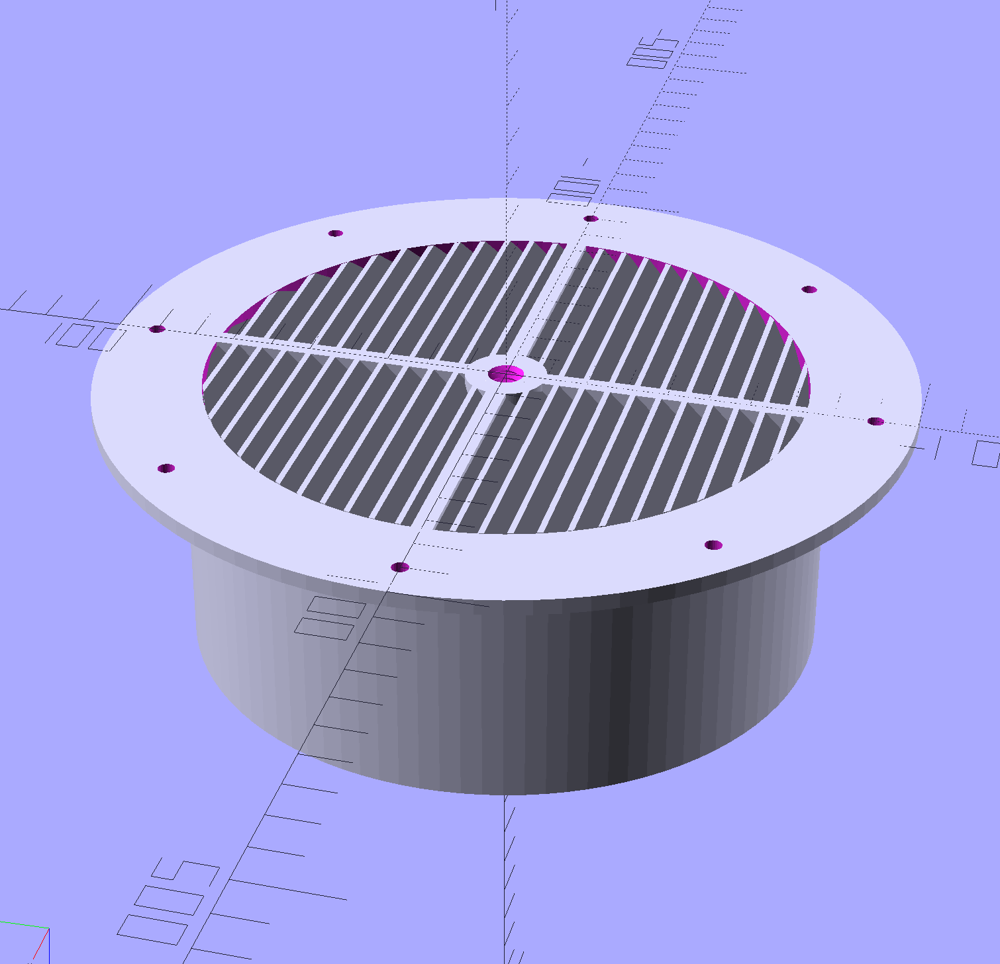

# AC Window Hose Adapter - A parametric design

A parametric, adjustable air vent system designed for 3D printing with customizable airflow control and easy installation.

## Overview

This OpenSCAD project creates a two-part fully customisable AC air vent window system consisting of:
- **Socket**: The main housing with mounting plate, pipe, and internal threading to be mounted on the window
- **Top**: The adjustable cover with external threading for airflow control to close the "hole"

## Features

- **Fully Parametric**: Customize all dimensions through OpenSCAD parameters
- **Adjustable Airflow**: Threaded mechanism allows precise airflow control
- **Angled Grid System**: Configurable fin angles and density for optimal air direction
- **Locking Mechanism**: Optional locking tabs prevent accidental adjustment
- **Mounting System**: Configurable mounting holes for various installation methods
- **Reinforced Structure**: Internal struts and reinforcing rings for durability

## Print Settings

Successfully printed on **Ender 3** with the following settings:
- **Layer Height**: 0.2mm
- **Infill**: 20%
- **Print Speed**: 50mm/s
- **Nozzle Temperature**: 210°C (PLA)
- **Bed Temperature**: 60°C
- **Supports**: None required

## Configuration Parameters

### General Settings
- `type`: Choose between "socket" or "top"
- `plate_diameter`: Base plate diameter (200mm default)
- `plate_height`: Base plate thickness (3.8mm default)

### Socket Parameters
- `pipe_diameter`: Main pipe diameter (157mm default)
- `pipe_height`: Pipe height (65mm default)
- `pipe_border`: Wall thickness (5mm default)
- `mounting_holes`: Number of mounting holes (2-8)
- `mounting_hole_diameter`: Hole size for screws (4mm default)

### Grid System
- `fin_angle`: Angle of airflow fins (0-90°, 45° default)
- `fin_amount`: Number of fins (25 default)
- `grid_wall_thickness`: Fin thickness (1mm default)
- `grid_height`: Grid depth (5mm default)

### Locking System
- `enable_lock`: Enable/disable locking tabs
- `lock_count`: Number of locking tabs (6 default)
- `lock_extension`: How far tabs extend inward (2.5mm default)

### Threading
- `thread_outer_diameter`: Thread diameter (8mm default)
- `thread_length`: Thread length (50mm default)
- `thread_step`: Thread pitch (2mm default)

## Customization

The design is fully parametric - modify any parameter in the OpenSCAD file to customize:
- Pipe dimensions for different duct sizes
- Grid patterns for various airflow requirements
- Mounting hole patterns for different installations
- Threading specifications for different adjustment ranges

## Dependencies

Includes the "Nut Job" library by Mike Thompson for threading functionality.

## License

All designs are released under the [CC BY-NC 4.0](https://creativecommons.org/licenses/by-nc/4.0/) license.  
You’re free to remix, adapt, and print these files for personal use as long as proper credit is given.  
**Commercial use is not permitted without permission.**

## Version History

- **V1.0** (07-08-2025): Initial release
  - Basic adjustable vent functionality
  - Parametric design
  - Locking mechanism
  - Tested on Ender 3

## Credits

Original design by Niccolo Zuppichini  
Threading system by Mike Thompson (Nut Job library)  
Thingiverse: https://www.thingiverse.com/thing:3896874

  
  <!-- 
  
   -->

