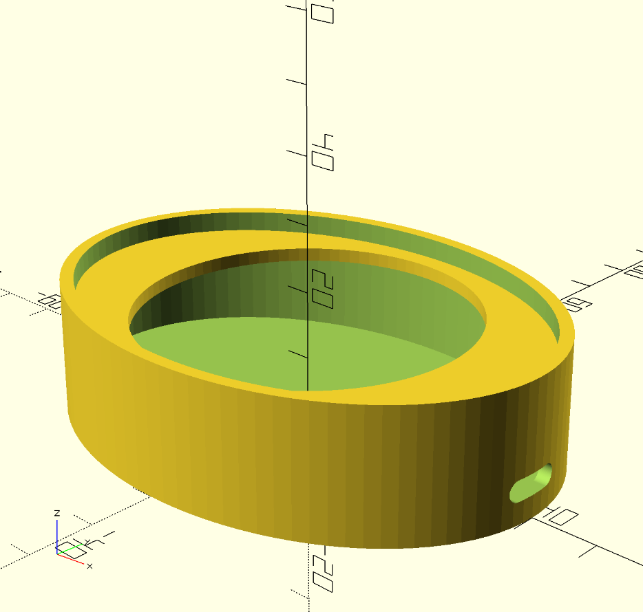

# Parametric DIY Customizable Wireless Charger

A fully customizable wireless charging station combining 3D printing and laser engraving for a personalized tech accessory.

## Overview

This project consists of two main components:
1. **3D Printed Base** - An elliptical case with an integrated mounting ring for the charging plate
2. **Laser Engraved Top Plate** - A customizable wooden plate with your choice of design or image

## What You'll Need

### Tools & Equipment
- 3D printer (FDM or resin)
- Laser engraver
- Wood glue or epoxy
- Sandpaper (optional, for finishing)

Technically you could print everything in a 3D printer but I am assuming you have access to a laser engraver.

### Materials
- 3D printing filament (PLA, PETG, or ABS recommended)
- Wooden sheet (3-5mm thickness recommended)
- Wireless charging module with USB-C input (TODO add link)

## Part 1: 3D Printed Base

### Customization Parameters

Open the `Housing.scad` file in OpenSCAD and adjust these parameters:

#### Case Dimensions
- `case_length` - Length of the case (default: 80mm)
- `case_width` - Width of the case (default: 60mm)
- `case_height` - Height of the case (default: 20mm)
- `wall_thickness` - Thickness of the walls (default: 2mm)

#### USB-C Port
- `usbc_width` - Port width (default: 9mm)
- `usbc_height` - Port height (default: 3.2mm)
- `usbc_z_position` - Height from bottom (default: 10mm)
- `usbc_angle` - Rotation around case (0-360°)

#### Inner Mount Structure
- `inner_circle_diameter` - Diameter of the wooden plate opening (default: 50mm)
- `inner_circle_height` - Height of the mounting ring (default: 5mm)
- `inner_ring_thickness` - Thickness of the ring (default: 2mm)

#### Recommended print settings:
   - Layer height: 0.2mm
   - Infill: 20%
   - Supports: Not required
   - Orientation: Print with bottom face down

## Part 2: Laser Engraved Wooden Plate

### Design Specifications

The wooden plate should match the `inner_circle_diameter` parameter from your 3D printed base (default):

Length (X): case_length - 2*wall_thickness = 80 - 4 = 76mm
Width (Y): case_width - 2*wall_thickness = 60 - 4 = 56mm

### Creating Your Design

1. Ensure that the dimension match with the inner diameter of your 3D printed case mounting rig
2. Create or prepare your custom image. There's a picture of a cat as example :)
3. Generate an SVG file with the exact dimensions using the provided python script
4. Engrave and cut on your laser engraver

### Running the script

# Generate with defaults (76mm × 56mm ellipse)
```
python generate_top_plate.py

# With your image
python generate_top_plate.py --image images/cat.png

# With text
python generate_top_plate.py --text "My Charger"
```

### Material Recommendations
I reccomend Plywood 3-5mm thick. Lighter woods work best for wireless charging efficiency.

## Assembly Instructions

1. **Print the base** - 3D print the elliptical case with your chosen parameters
2. **Install electronics** - Place the wireless charging coil inside the cavity
3. **Wire the USB-C port** - Connect the charging module to the USB-C connector
4. **Test functionality** - Verify charging works before final assembly
5. **Prepare the wooden plate** - Laser engrave your design and cut to size
6. **Glue the plate** - Apply wood glue to the mounting ring and press the wooden plate firmly
7. **Finishing touches** - Sand edges if needed, apply finish to wood or paint

## Tips &

<div style="display: grid; grid-template-columns: repeat(2, auto); gap: 10px;">
  

</div>


### TODOs

[ ] figure out how to specify with sections to cut and which to engrave
[ ] try out the design